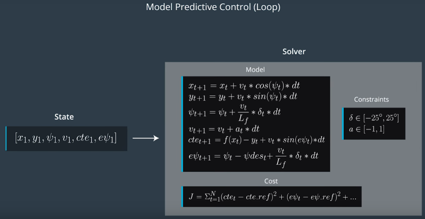

# MPC_Cman

## Submission for Term2 Project 5: Model Predicted Controller

__Objective:__ Implement a Model Predictive Control (MPC) algorithm in C++ to control steering and throttle of a simulated vehicle driving a simulator track of reference waypoints.

Passing the project requires a successful simulator track run and documentation, pls see project rubics: https://review.udacity.com/#!/rubrics/896/view. Boilerplate code provided by Udacity under https://github.com/udacity/CarND-MPC-Project.

Improvements made to:

* src/[main.cpp](./src/main.cpp)
* src/[MPC.cpp](./src/MPC.cpp)

## Implementation

> The Model

Detailed description of the used model including state, actuators and update equations.

The MPC uses a __global kinematic model__ (bicycle) to resolve the vehicle state for a prediction horizon. The state is described by 6 dimensions: __x- and y__-coordinate of vehicle position, vehicle heading __psi__, vehicle velocity __v__, cross track error __cte__ as deviation from reference line, and the error in heading __epsi__. The horizon T is __N__ steps of duration __dt__. The IPOPT solver uses the initial state and actuators (steering __delta__ and throttle __a__ within specific constraints) returning a vector of control inputs for each time step __[delta_1..N a_1..N]__ that minimize the cost function of the model. Actuations for the next time step are pushed to the vehicle state and the prediction loop is repeated. The model is simplified eg. __ignoring tire dynamics__.

## Timestep Length and Elapsed Duration (N & dt)

> Discussion of the reasoning behind the chosen N (timestep length) and dt (elapsed duration between timesteps) values including previous values tried.

N determines the number of steps for which the cost function will be optimized for by the solver. Large N lead to consuming solver calculations impacting MPC performance. dt determines the distance between consequent actuations and large dt result in larger devitations from the reference trajectory. Increasing oscillations indicate thresholds for the specific configuration. Choise is __N=8__ and __dt=0.12s__ where the vehicle is able to properly navigate the track and resulting in prediction horizon __T=~1sec__ with fixed set of weights and including latency. Thus, models optimizer is looking at a 1sec duration to determine a corrective trajectory. Adjusting N or dt mainly causes erratic behavior, oszillation, soon off track running. Other values tried include 20/0.05, 10/0.10, 6/0.15, 5/0.2, and more.

## Polynomial Fitting and MPC Preprocessing

> Description of polynomial fitting and preprocessing of waypoints, vehicle state and actuators prior to the MPC procedure.

The reference trajectory is calculated with fitting a __3rd-order polynomial__ to waypoints returned by the simulator. In advance to the fitting the waypoints are converted to car-coordinate scheme. Waypoints are shifted and rotated. Then cte and epsi are calculated by solving the polynomial at __x=0__. Thus, the __angle__ of the reference trajectory rests with the x-axis at the origin.

Weights were tuned so that __large actuations__ were penalized but __change rates__ of delta and a still set reactive to curvey road conditions. This helps for smoother steering but a brief tendency to overshoot running high speed. Larger weight on cte caused instability. Orientation error psi was penalized stronger to allow curvey road adaption. Weight of the velocity difference dif v gradually increased until __reference velocity of ~90mph__ achieved. Pls see final weight values:

* weight cte: 20
* weight epsi: 3000
* weight dif v: 1000
* weight delta: 5000
* weight a: 500
* weight delra rate: 500
* weight a rate: 50

## Model Predictive Control with Latency

> Details on the 100 millisecond latency handling.

Latency of 100ms is modeled in projecting the x-position of the current state and speed into the future. The __x-position with 0.1sec updated__ and all unchanged state variables are passed to the solver.

Note: Steering angle is flipped (multiplied by -1) to reflect turning conventions of simulator and MPC model. The calculated steer value is normalized and flipped before back-passing to the simulator.

## Compilation and Simulation

> build instructions: run shell-commands from the project directory

1. Clone this repo.
2. Make a build directory: mkdir build && cd build
3. Compile: cmake .. && make
4. Run it: ./mpc.
5. Run and start the MPC simulator (resolution: 600x800, Mode: fantastic)

## Environment
* OS Setup: Ubuntu 16.4, for details pls see [here](https://classroom.udacity.com/nanodegrees/nd013/parts/40f38239-66b6-46ec-ae68-03afd8a601c8/modules/0949fca6-b379-42af-a919-ee50aa304e6a/lessons/f758c44c-5e40-4e01-93b5-1a82aa4e044f/concepts/23d376c7-0195-4276-bdf0-e02f1f3c665d)
* Ipopt and CppAD packages: Please refer to this document for installation instructions: https://github.com/udacity/CarND-MPC-Project/blob/master/install_Ipopt_CppAD.md
* Eigen package: Eigen is already part of the repo, pls see: http://eigen.tuxfamily.org/index.php?title=Main_Page
* Simulator: The project involves Term 2 Simulator which can be downloaded here: https://github.com/udacity/self-driving-car-sim/releases. A server package uWebSocketIO is setting up a connection from the C++ program to the simulator, which acts as the host. Read the [DATA.md](https://github.com/udacity/CarND-MPC-Project/blob/master/DATA.md) for a description of the data sent back from the simulator.
